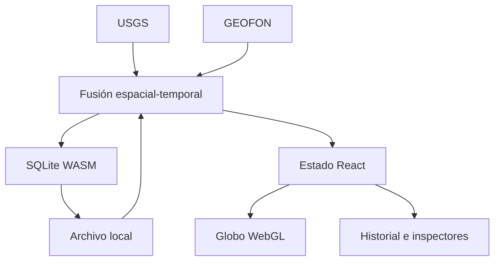

# Arquitectura de Episismic

## Objetivo

Episismic se divide en cuatro sistemas para evitar que el volumen de estaciones, formas de onda o capas bloquee el globo:

1. **Adquisición:** adaptadores FDSN y GeoJSON convierten fuentes externas al dominio común; el navegador consulta inventarios y ventanas instrumentales sin generar señales.
2. **Persistencia:** SQLite conserva el catálogo, todas las revisiones y metadatos; el navegador lo ejecuta en WebAssembly.
3. **Dominio:** terremotos, estaciones, alertas y futuros riesgos no dependen de React ni de MapLibre.
4. **Presentación:** React administra paneles y filtros; MapLibre renderiza teselas y GeoJSON en WebGL.

## Flujo actual

La actualización de un evento no reemplaza silenciosamente su historia. El resumen se actualiza y `event_updates` conserva cada `source_updated_at` distinto.

## Telemetría instrumental y futuro SeedLink

La edición 1.0.2 consulta el inventario de canales del proveedor FDSN correspondiente y muestra ventanas de datos instrumentales reales mediante el servicio gráfico oficial de EarthScope. Si un canal o intervalo no está disponible, la interfaz declara la ausencia de datos y no fabrica una traza.

Los navegadores no hablan SeedLink por TCP de forma fiable y GitHub Pages no ejecuta procesos persistentes. El streaming continuo de baja latencia requerirá posteriormente un ingestor independiente, compatible con Python o Java, que:

- conserva la resolución de redes y canales mediante FDSN Station;
- mantiene conexiones SeedLink;
- decodifica miniSEED;
- calcula métricas y detecciones sin enviar todas las muestras al cliente;
- expone WebSocket para telemetría y alertas;
- archiva segmentos de onda fuera del repositorio Git.

La web seguirá funcionando con USGS aunque ese servicio no esté disponible.

## Rendimiento

- Cartografía por teselas y globo vectorial: no se amplía una textura global fija.
- Natural Earth de países y ciudades se distribuye con la aplicación para que el modo político no dependa de un host externo.
- GeoJSON procesado en los Web Workers de MapLibre.
- Capas WebGL separadas para terremotos, estaciones y volcanes, conservando cada símbolo individual.
- Actualización multifuente desacoplada a 30 segundos.
- Persistencia SQLite diferida para agrupar escrituras.
- Listado histórico limitado a los 900 registros más recientes; el mapa conserva el conjunto completo con marcadores individuales.
- Tamaño y contraste de los símbolos ajustados sin ocultar eventos por niveles de detalle.
- Símbolos WebGL y halos separados para conservar contraste sin extrusiones ni elementos DOM por estación.

Próximos pasos técnicos: Web Worker dedicado para SQLite y servicio SeedLink/WebSocket para detecciones de forma de onda previas a los catálogos.

## Multirriesgo

`phenomena.kind` admite `earthquake`, `volcano`, `storm` y `fire`. Cada módulo especializado amplía el fenómeno sin modificar el contrato común de posición, tiempo, estado, significancia y fuente. Las capas del globo consumen selectores por tipo y no consultas SQL directas.
