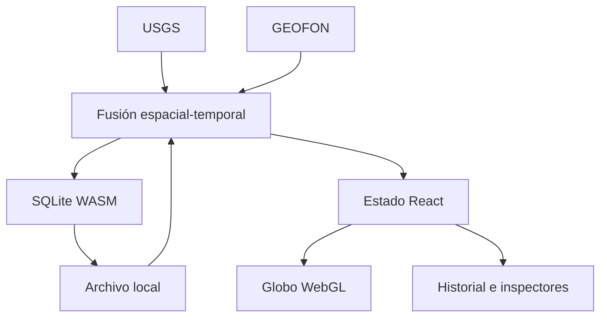

# Arquitectura de Episismic

## Objetivo

Episismic se divide en cuatro sistemas para evitar que el volumen de estaciones, formas de onda o capas bloquee el globo:

1. **Adquisición:** adaptadores FDSN y GeoJSON convierten fuentes externas al dominio común; el navegador consulta inventarios y ventanas instrumentales sin generar señales.
2. **Persistencia:** SQLite conserva el catálogo, todas las revisiones y metadatos; el navegador lo ejecuta en WebAssembly.
3. **Dominio:** terremotos, estaciones, alertas y futuros riesgos no dependen de React ni de MapLibre.
4. **Presentación:** React administra paneles y filtros; MapLibre renderiza teselas y GeoJSON en WebGL.

## Flujo actual

La actualización de un evento no reemplaza silenciosamente su historia. El resumen se actualiza y `event_updates` conserva cada `source_updated_at` distinto.

## Telemetría instrumental en tiempo real

La edición 1.1.0 incorpora una ruta instrumental real completamente ejecutable desde el navegador:

1. FDSN Station localiza el canal activo y prioriza HH, BH, EH, HN, LH y SH.
2. El cliente abre `wss://rtserve.earthscope.org/seedlink` y se suscribe al identificador NSLC exacto.
3. `seisplotjs` negocia SeedLink, decodifica cada paquete MiniSEED y entrega sus muestras y marcas UTC.
4. Episismic conserva los bloques en una ventana temporal, elimina duplicados y descarta datos ya fuera de pantalla.
5. El canvas aplica un pasa-banda Butterworth, agrupa mínimos y máximos por píxel y dibuja la señal sin convertirla en una imagen estática.
6. Si no llegan paquetes por WebSocket, FDSN Dataselect recupera el mismo canal y la misma ventana como respaldo instrumental real.

El navegador no puede abrir los SeedLink TCP tradicionales en el puerto 18000. Por ello el directo inmediato cubre los canales federados por el WebSocket público de EarthScope; GEOFON, NCEDC, BMKG u otras redes continúan mediante FDSN cuando no están presentes allí. Extender el directo a todos sus servidores TCP requerirá un puente SeedLink→WebSocket propio, pero la interfaz nunca suplanta un fallo con muestras inventadas.

La web seguirá funcionando con los catálogos sísmicos aunque la telemetría instrumental no esté disponible.

## Rendimiento

- Cartografía por teselas y globo vectorial: no se amplía una textura global fija.
- Natural Earth de países y ciudades se distribuye con la aplicación para que el modo político no dependa de un host externo.
- GeoJSON procesado en los Web Workers de MapLibre.
- Capas WebGL separadas para terremotos, estaciones y volcanes, conservando cada símbolo individual.
- Actualización multifuente desacoplada a 30 segundos.
- Persistencia SQLite diferida para agrupar escrituras.
- Listado histórico limitado a los 900 registros más recientes; el mapa conserva el conjunto completo con marcadores individuales.
- Tamaño y contraste de los símbolos ajustados sin ocultar eventos por niveles de detalle.
- Símbolos WebGL y halos separados para conservar contraste sin extrusiones ni elementos DOM por estación.

Próximos pasos técnicos: Web Worker dedicado para SQLite y puente SeedLink TCP→WebSocket multirred para ampliar el directo más allá de EarthScope.

## Multirriesgo

`phenomena.kind` admite `earthquake`, `volcano`, `storm` y `fire`. Cada módulo especializado amplía el fenómeno sin modificar el contrato común de posición, tiempo, estado, significancia y fuente. Las capas del globo consumen selectores por tipo y no consultas SQL directas.
