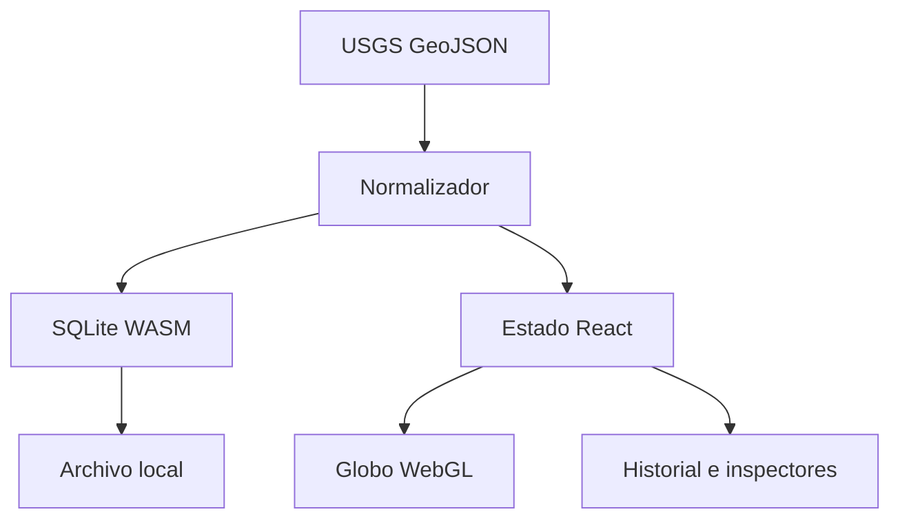

# Arquitectura de Episismic

## Objetivo

Episismic se divide en cuatro sistemas para evitar que el volumen de estaciones, formas de onda o capas bloquee el globo:

1. **Adquisición:** adaptadores FDSN/GeoJSON/SeedLink convierten fuentes externas al dominio común.
2. **Persistencia:** SQLite conserva el catálogo, todas las revisiones y metadatos; el navegador lo ejecuta en WebAssembly.
3. **Dominio:** terremotos, estaciones, alertas y futuros riesgos no dependen de React ni de Three.js.
4. **Presentación:** React administra paneles y filtros; react-globe.gl/Three.js renderiza capas WebGL.

## Flujo actual

La actualización de un evento no reemplaza silenciosamente su historia. El resumen se actualiza y `event_updates` conserva cada `source_updated_at` distinto.

## Ingesta en directo futura

Los navegadores no hablan SeedLink de forma fiable y GitHub Pages no ejecuta procesos persistentes. La segunda fase añadirá un servicio de ingesta independiente, compatible con Python o Java, que:

- descubre redes mediante FDSN Station;
- mantiene conexiones SeedLink;
- decodifica miniSEED;
- calcula métricas y detecciones sin enviar todas las muestras al cliente;
- expone WebSocket para telemetría y alertas;
- archiva segmentos de onda fuera del repositorio Git.

La web seguirá funcionando con USGS aunque ese servicio no esté disponible.

## Rendimiento

- Renderizado WebGL y capas filtradas antes de llegar al globo.
- Actualización de catálogo desacoplada a 60 segundos.
- Persistencia SQLite diferida para agrupar escrituras.
- Catálogo histórico limitado por consulta y preparado para paginación.
- Separación del paquete de globo en un chunk propio.
- Adaptación de densidad por filtros y ventana temporal.

Próximos pasos técnicos: Web Worker para SQLite, agrupación espacial de estaciones, LOD de fallas, teselas batimétricas de alta resolución y servicio WebSocket.

## Multirriesgo

`phenomena.kind` admite `earthquake`, `volcano`, `storm` y `fire`. Cada módulo especializado amplía el fenómeno sin modificar el contrato común de posición, tiempo, estado, significancia y fuente. Las capas del globo consumen selectores por tipo y no consultas SQL directas.
